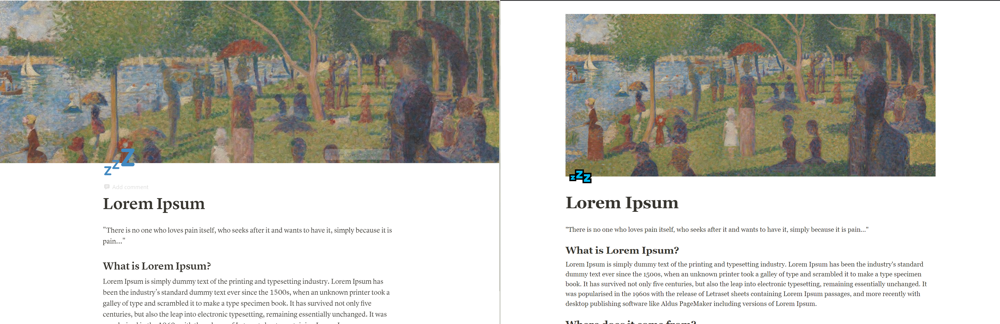
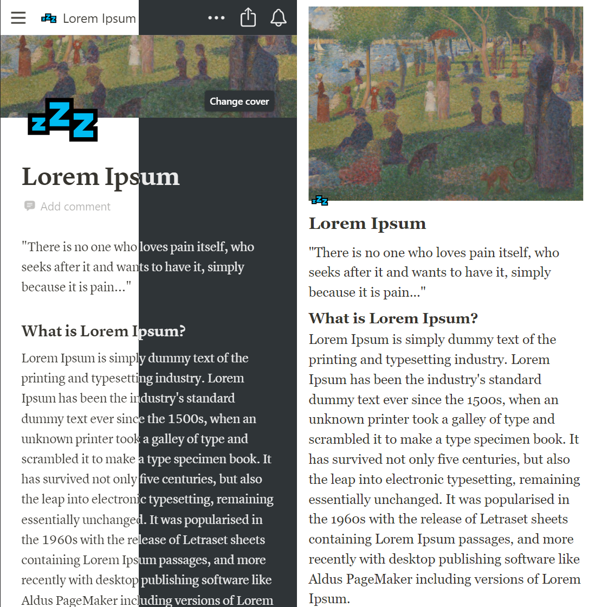

# notion_html
Testing Notion export to HTML function with a page with simple text, cover and emoji.

[Link](https://futomakiyoin.github.io/notion_html/)

[How to Export as HTML](https://www.notion.so/Export-as-HTML-bf3fe9e6920e4b9883cbd8a76b6128b7)

## Comparison 8/16/2021 ##
Native on the left ⬅️,
Exported HTML on the right ➡️.

### Desktop ###

- Different Emojis (follows system's for web browser)
- Cover has padding
- Font is different. Still serif at least.
- Colors slightly different
- Text margins different
- Font sizes varied
- Editing options (expected)
- 
### Mobile ###

- **Does not have dark mode**
- Different Emojis (follows system's for web browser)
- Cover has padding
- Font is different. Still serif at least.
- Colors slightly different
- Text margins different
- Font sizes varied
- Editing options (expected)
